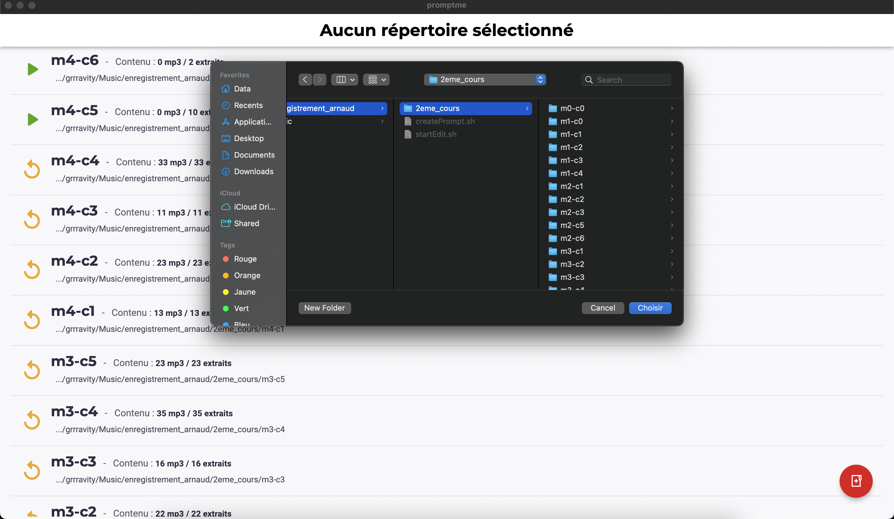
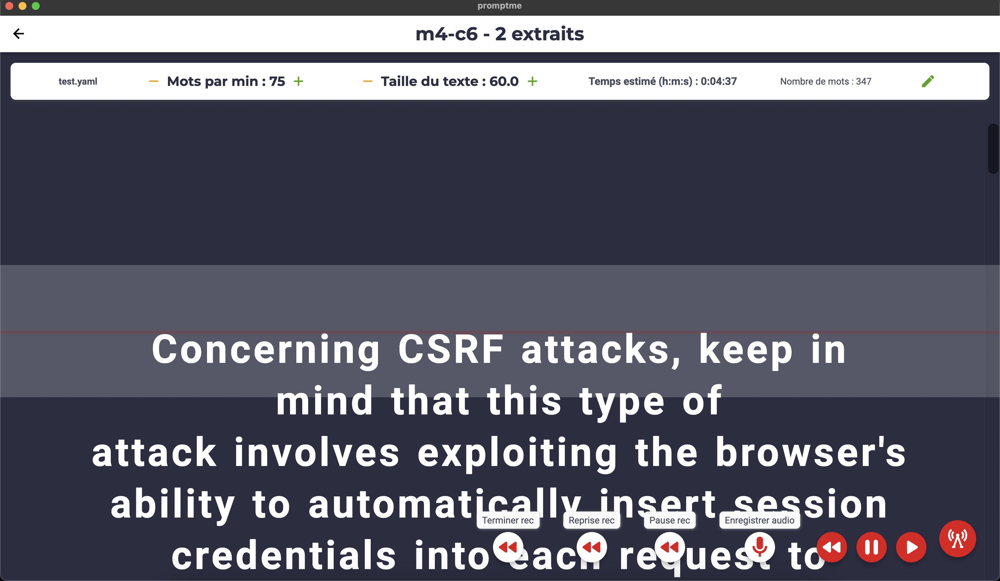
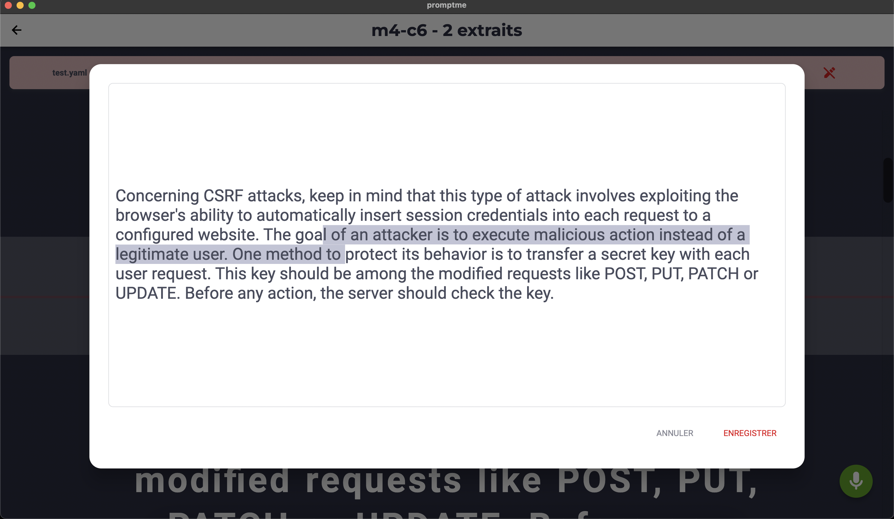
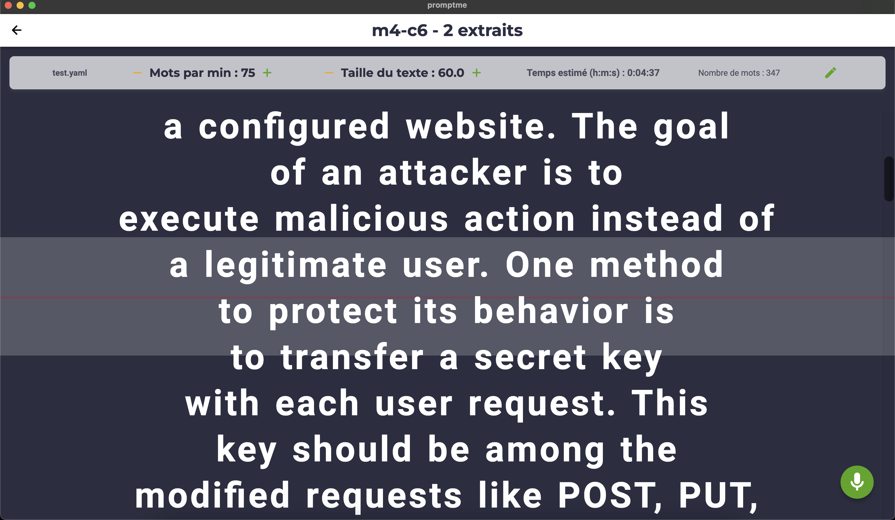

# Promptme

Flutter project to prompt yaml inputs for audio recording and give cool features like :
- Play / Pause / Jump back / Jump forth at any time
- Edit prompted text on pause
- Saves modifications to the yaml file
- Record audio directly from the app (play, pause, resume and stop. outputs are saved as .m4a)

**Full support desktop** Currently, i'm only testing desktop.

I'll make adjustment for mobile one day :')


<a href="url">

</a>

<a href="url">

</a>



## Requirements

1. A folder structure like this where you put your yaml files (on your machine):

```
AudioProjectMainFolder
│  ...
│
└───FirstProjectFolder
│   │   audiocontent.yaml
│   │   audioOutput1.mp3
│   │   audioOutput2.mp3
│   │   ...
│   
└───SecondProjectFolder
    │   audiocontent.yaml
    │   audioOutput1.mp3
    │   ...
```


1. A yaml file containing this keys (must not be nested into a parent) :

```yaml
---
sections:
    text: "blablabla"

```

## Next features
- Translations
- More flexibility on folder structure && yaml structure
- Microphone input selector
- Audio quality selector
- UI optimizations
- Text section detection (to scroll to a section or to name audio output regarding sections)

## Getting started

Pull it and run `Flutter run`

Flutter is required on your machine
